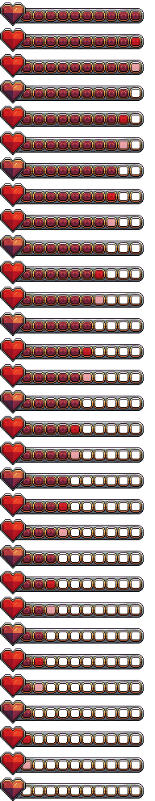

# Sistema de salud

> El HP es el recurso central del combate. No se regenera.

---

## Parámetros

100
hp inicial
Ambos jugadores

0
umbral de derrota
Fin inmediato del combate

—
regeneración
Ninguna

---

## Representación en la interfaz (UI)

La barra de salud representa visualmente el estado actual del HP del jugador durante el combate. Su diseño está orientado a una lectura inmediata del estado de supervivencia.

<figure markdown>
  { width=45% }
  <figcaption>Representación visual de la barra de salud del jugador. El valor disminuye de forma directa conforme se recibe daño, sin regeneración durante el combate.</figcaption>
</figure>

---

## Comportamiento del daño

!!! warning "Sin regeneración"
    El HP perdido durante el combate es **permanente durante toda la pelea**. No existen mecánicas de recuperación, objetos de curación ni regeneración por tiempo.

!!! abstract "Aplicación instantánea"
    El daño se aplica en el **frame de impacto**, es decir, el frame exacto en el que el hitbox del ataque colisiona con el hurtbox del oponente. No existe retraso ni interpolación entre el golpe y la reducción de HP.

---

## Daño por tipo de ataque

| Tipo de ataque | Nivel de daño |
|----------------|:-------------:|
| Primario (puñetazo) | Bajo |
| Secundario (patada) | Alto |

Los valores exactos de daño se definen en la capa de implementación. La intención de diseño es una diferencia significativa entre ambos tipos de ataque, donde el ataque secundario representa una amenaza importante por golpe.

---

## Invulnerabilidad temporal

!!! note "Frames de invulnerabilidad post-golpe"
    Tras recibir daño, el jugador entra en un breve estado de **invulnerabilidad (i-frames)**. Durante este tiempo, los ataques entrantes no registran impacto.

    Esto evita que un mismo ataque sostenido aplique daño continuo durante el retroceso. Impone un intervalo mínimo entre impactos a nivel de sistema.

---

## Condición de derrota

!!! danger "Derrota"
    Cuando el HP de un jugador llega a **0**, el combate termina inmediatamente. El oponente es declarado ganador. No existe un valor inferior a 0 — la condición se activa en el momento exacto en que se alcanza cero.