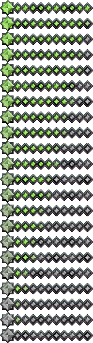

# Sistema de energía

> Recurso acumulativo generado mediante la interacción en combate. Diseñado como base para mecánicas futuras.

---

## Parámetros

0
mínimo
Valor base

100
máximo
Límite superior

0
ganancia pasiva
Por segundo

---

## Representación en la interfaz (UI)

La barra de energía representa visualmente el estado acumulado del recurso durante el combate. Su diseño permite una lectura inmediata del nivel de participación activa del jugador dentro del sistema.

<figure markdown>
  { width=45% }
  <figcaption>Barra de energía del jugador. Refleja la acumulación progresiva del recurso mediante interacciones de combate como ataques, bloqueos y recepción de daño.</figcaption>
</figure>

Estados de la barra de energía:

- **Estado vacío (0)**: El jugador no ha generado interacción relevante en combate. No hay recursos acumulados.
- **Estado en acumulación (1–99)**: Indica participación activa en combate. La barra refleja progresión basada en acciones como ataques, bloqueos o recepción de daño.
- **Estado máximo (100)**: La barra se encuentra completamente llena. Representa el límite superior del sistema; no se generan valores adicionales más allá de este punto.

La barra no disminuye en ningún momento durante el combate y actúa como un registro persistente de participación activa dentro del sistema de combate.

---

## Tabla de generación

La energía se genera exclusivamente mediante interacciones activas en combate. Toda acumulación pasiva es cero.

| Activación | Energía obtenida |
|-----------|:----------------:|
| Recibir daño | +2 |
| Ataque primario exitoso | +5 |
| Ataque secundario exitoso | +10 |
| Activar bloqueo | +3 |

!!! tip "Intención de diseño"
    Las tasas de generación están equilibradas para recompensar el **riesgo y la interacción**: recibir daño, bloquear y acertar ataques fuertes generan más energía que jugar de forma pasiva. Un jugador que no interactúa no genera energía.

---

## Reglas del sistema

- La energía **no puede superar** 100  
- La energía **no disminuye** con el tiempo  
- La energía **no se consume** en ninguna mecánica actual  
- La generación requiere **interacción directa en combate** — no existe ganancia pasiva  

---

## Estado actual de implementación

!!! abstract "Sin uso activo en combate"
    A partir de la versión 1.0, la energía **no tiene efecto en la jugabilidad**. El sistema está completamente implementado a nivel de datos e interfaz como base para mecánicas futuras — ataques especiales, movimientos mejorados o modificadores de estado.

    No diseñar sistemas que dependan de que la energía tenga un efecto actual.