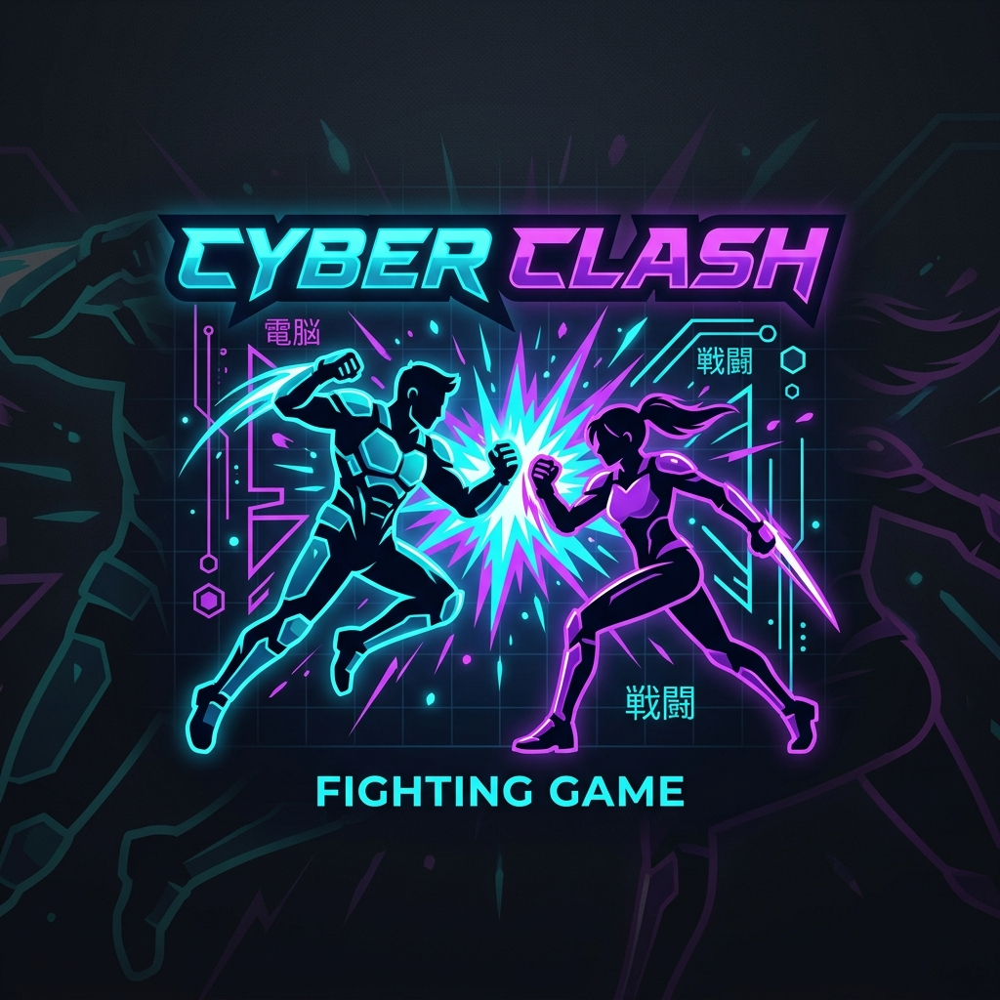

---
hide:
  - navigation
  - toc
---

# ⚔️ Bienvenido a Game Combat 2D

  
  
  
El motor definitivo de peleas 2D. Una experiencia multijugador local diseñada para ser rápida, táctica y brutal.

 

-   :material-book-open-page-variant: **[Manual del Jugador](08-manual-usuario.md)**

    Aprende las mecánicas, estrategias y cómo dominar la arena. Todo lo que necesitas para ganar está aquí.

-   :material-gamepad-variant: **[Controles Básicos](01-controls.md)**

    Domina el teclado. Descubre cómo moverte, esquivar y desatar combos con tus poderes especiales.

-   :material-sword-cross: **[Sistema de Combate](02-combat-system.md)**

    Conoce las reglas técnicas: hitboxes, frames de invulnerabilidad y el cálculo de daño interno.

-   :material-github: **[Repositorio Oficial](https://github.com/Brayaan/game-combat-2d)**

    Explora el código fuente, reporta errores o aporta tus propias ideas al desarrollo del proyecto.

